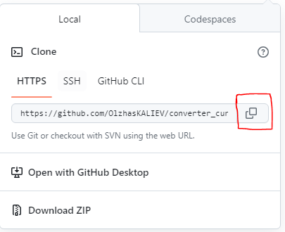
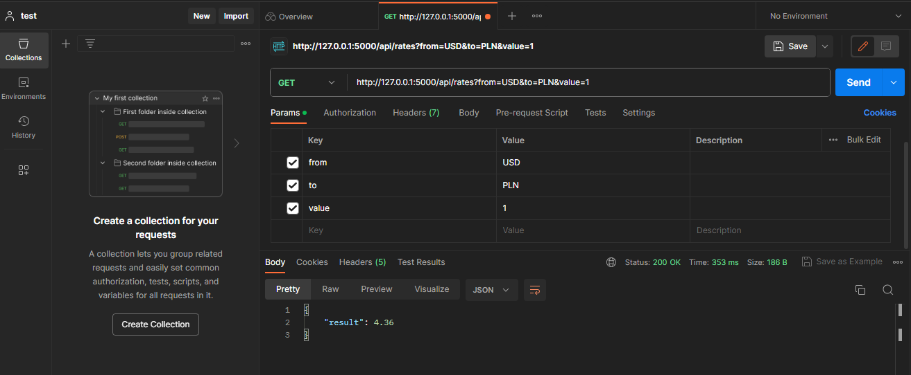
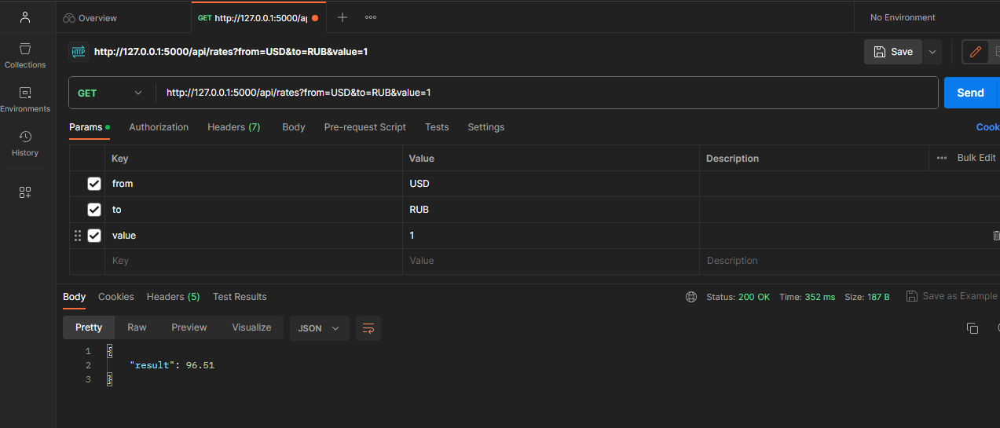

# converter_currency

команды прописывать в термминале

клонируем репозиторий себе на ПК командой git clone <ссылка на проект>

команда: git clone https://github.com/OlzhasKALIEV/converter_currency.git

установка зависимосетей команда: pip install -r .\requirements.txt

запустить сервер python .\app.py run 

рекомендую использовать postman

выполнить запрос GET

GET: http://127.0.0.1:5000/api/rates?from=USD&to=PLN&value=1

GET: http://127.0.0.1:5000/api/rates?from=USD&to=RUB&value=1

